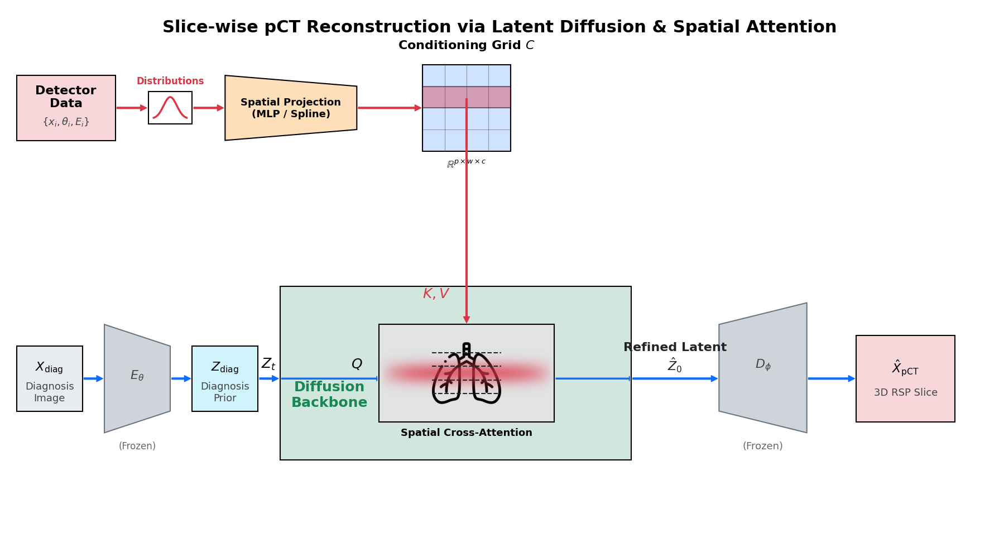
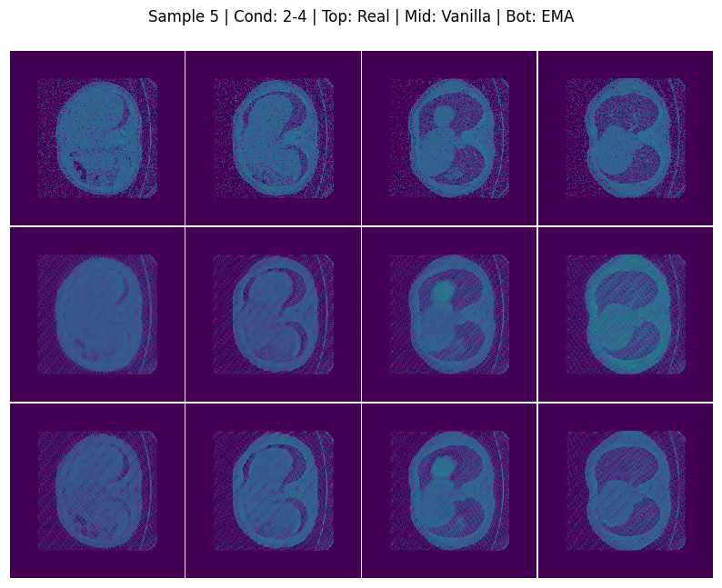

# FLORA AI
Flow-based Latent-informed Optimization for 3D proton-CT Reconstruction with Spatial Attention

## Proton Computed Tomography
An alternative of traditional radiotherapy is hadron therapy, which utilizes the energy deposition of protons (or carbon ions), which can concentrate  more on the malignant part (the tumor). This method sounds good, but current medical devices are not able to measure what would be the possible stopping powers applied on the protons as they pass through the patient. The goal of this project to make a generative AI based pipeline that can reconstruct the proton-relative stopping power (RSP), which can be used treatment planning.

## Methods
Similarly to many 3D image generation models we are using a 2 stage pipeline. The first stage a simple VAE-GAN to learn a good medical image representation, inspired by NVIDIA MAISI. Additionally we force latent space to mimic medical conditions. This way at stage 2 we can start to reconstruct our 3D images from the latent space of the specific medical condition and only condition in detector data.

The detector informations (scattering angles and energy loss) are coming in a large quantity so we convert them into multivariate-gaussians and project them into latent space. In the latent space we  convert the initial image with the particle scattering conditioning and spatial attention. The reasoning behind it is that protons don't directly pass through the materials, but they suffer scattering. This means that the final angle and energy loss of the particle is not give us information of the slice but for some extent its environment.

## Results
The results of stage 1 looks extremly promising.

The discriminator setup clearly forced the model to not just average out pixel values but to learn biological structures. We are currently running the particle scattering simulations to start stage 2.